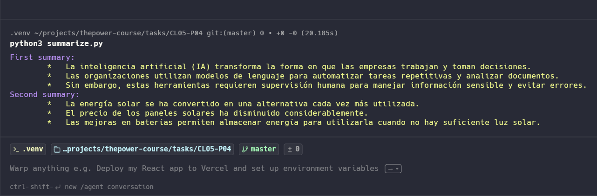
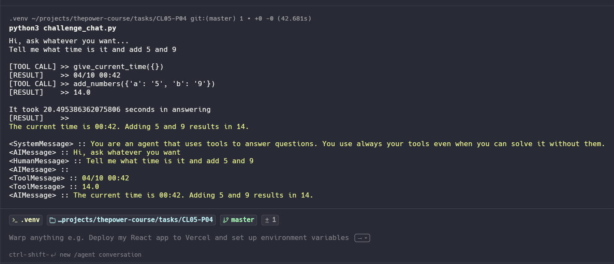

# 🚀 Proyect 4 from class 5

## Summarizer

Command to use the summarizer:

```bash
python3 summarize.py
```

## Chat with memmory and tools

Command to use the chat:

```bash
python3 challenge_chat.py
```

## Attachments

### Summarizer output



### Chat challenge output

